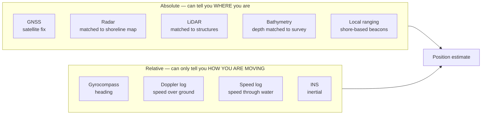
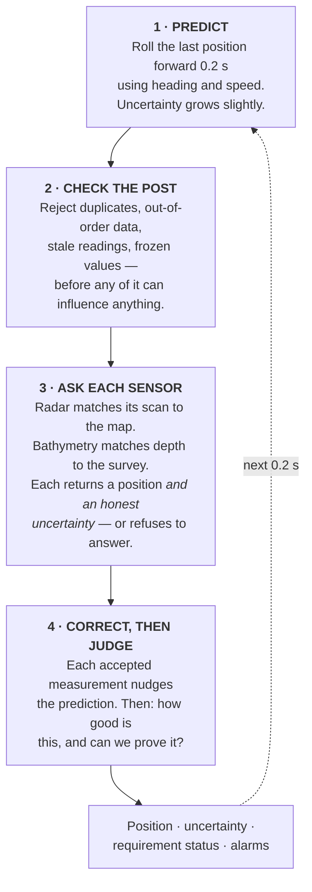
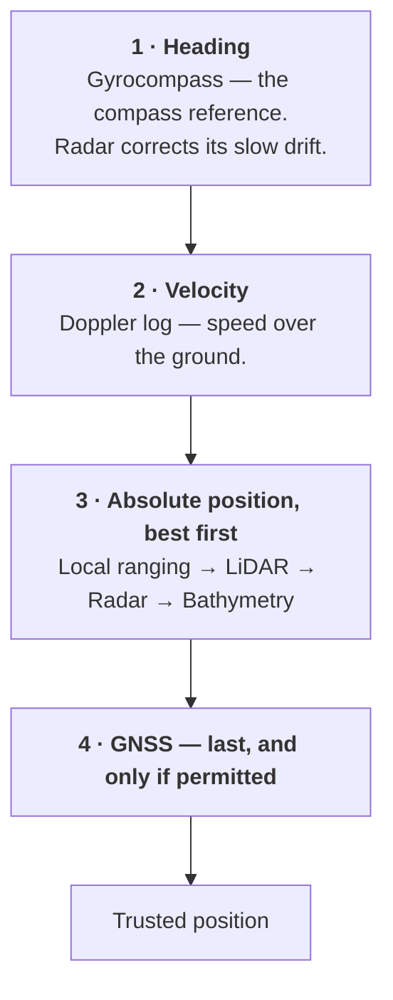
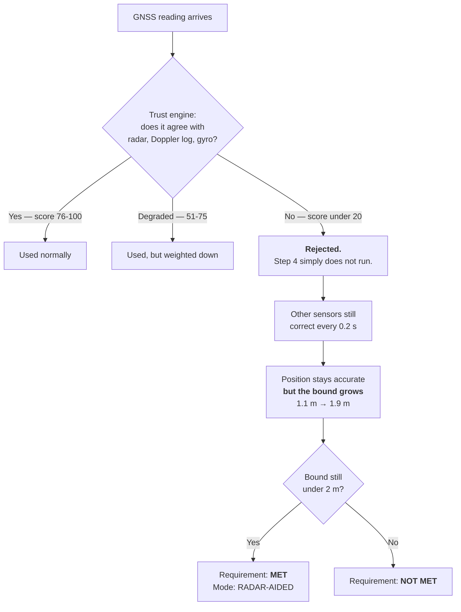
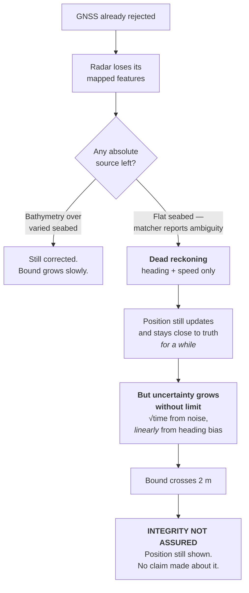
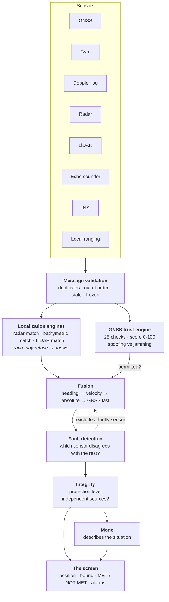

# How the platform works out where the vessel is

A plain-language explanation of what happens between the sensors and the number
on the screen — and what happens when GNSS, or radar, or both, stop being
useful.

Written to be read by someone who is not a navigation engineer.

---

## 1. The thing most people expect, and why it is wrong

Most people assume a system like this works by switching:

> "Use GPS. If GPS fails, switch to radar. If radar fails, switch to something
> else."

**This platform does not work that way, and deliberately so.**

Switching is where these systems usually go wrong. There is always a moment
mid-switch when the old source has been abandoned and the new one has not yet
been established, and that moment is exactly when the vessel is least sure where
it is. Worse, a switch is a decision — and a decision made on bad information is
how a system ends up confidently wrong.

Instead:

> **Every sensor contributes all of the time, and each one is weighted by how
> uncertain it admits to being.**

When GNSS disappears, nothing switches over. The remaining sensors simply carry
more of the load, and the reported uncertainty grows — because there genuinely
is less information available. The transition is continuous. Nothing is ever
"handed over".

The modes you see on screen — `NORMAL GNSS`, `RADAR-AIDED NAVIGATION`,
`DEAD RECKONING` — are a **description** of what is currently contributing.
They do not control anything. They are a label on the situation, not a switch.

---

## 2. Two kinds of sensor, and why the difference decides everything

This is the single most important distinction in the whole system.

**Absolute sensors** fix you to a place on the earth. There are five, and they
work on completely different physics: radio from satellites, radar reflection
off a mapped shoreline, laser off structures, sound off the seabed, and acoustic
ranging to shore beacons.

**Relative sensors** only tell you how you are moving. They let you carry a
position forward, but they can never establish one. If you start from the wrong
place, dead reckoning keeps you wrong forever — and it does so smoothly and
confidently, which is what makes it dangerous.

**Everything else in this document follows from that distinction.** The reason
the requirement can go from `MET` to `NOT MET` while the vessel is sailing
perfectly normally is simply that the absolute sensors have run out.

---

## 3. What happens five times every second

The platform recalculates everything every 0.2 seconds. Each cycle has four
phases.

### Phase 1 — Predict

Take the last known position and velocity and move it forward 0.2 seconds.
Heading is advanced using the gyro's measured **rate of turn**, so the estimate
follows the vessel round a bend instead of being surprised by it.

At this point the estimate uses no new measurements at all. That matters: it is
the honest prediction against which every incoming reading will be judged.

### Phase 2 — Check the post before opening it

Incoming messages are inspected for defects first — duplicated sequence numbers,
timestamps out of order, data too old to use, values that have stopped changing.
Anything malformed is rejected before it can influence anything.

### Phase 3 — Ask each sensor what it thinks

The localization engines run. Radar matches its scan against the shoreline map;
bathymetry matches the recent depth profile against the seabed survey; LiDAR
matches structures.

Each returns a position **and an honest statement of how uncertain it is** — or
declines entirely, saying in effect *"this terrain cannot tell me where I am."*
That refusal is a feature, not a failure. A guess here is a confidently wrong
position, which is the single most dangerous output a navigation system can
produce.

Separately, the GNSS trust engine compares the satellite fix against everything
else and scores it out of 100.

### Phase 4 — Correct, then judge

Each accepted measurement nudges the prediction toward itself, in proportion to
how confident it is. Then the platform asks the question the product exists to
answer: **how good is this answer, and can I prove it?**

---

## 4. The order of correction — and why GNSS goes last

Within Phase 4 the order is deliberate.

**Heading first**, because a speed only becomes north-and-east motion once you
know which way the bow is pointing. Get heading wrong and every subsequent
calculation inherits the error. The gyro's slow drift is tracked as part of the
estimate; radar supplies an *absolute* heading that corrects that drift.

**Then velocity**, which moves the estimate the right distance in the right
direction.

**Then absolute positions**, best first — the most trustworthy source gets first
say.

**Then GNSS, last of all.** This is not an accident of implementation. GNSS is
the least trustworthy sensor in this design, because it is the only one an
attacker can forge from a distance with modest equipment. So it is applied to an
estimate that has *already* been corrected by physics that cannot be spoofed
remotely — which is precisely what makes a fake GNSS fix stand out.

---

## 5. What happens when GNSS fails

**The mechanism is that simple: step 4 of the correction does not run.** There
is no failover procedure to get wrong, because there is no failover.

What the client sees:

- The position **stays accurate**. Across every GNSS attack in the test set, the
  error stays under a metre — because the platform never believed the false fix
  in the first place.
- The **protection level grows**, typically from about 1.1 m to about 1.9 m.
  Fewer independent sources means a weaker guarantee, and the number says so.
- If the bound is still inside 2 m, the banner still reads `MET` — and that is
  the truth, not optimism.

---

## 6. What happens when radar fails as well

This is the case that matters, because it is where an honest system and a
plausible-looking one part company.

Step by step:

1. Bathymetry may still work — over varied seabed it is a genuine absolute fix.
   Over a flat, dredged basin a hundred places look identical, so it reports
   **ambiguity** and contributes nothing.
2. With no absolute source at all, the estimate runs on **dead reckoning**:
   heading and speed carried forward from the last known good position.
3. The position does not jump, and it is not lost. It keeps updating and stays
   close to the truth for a while.
4. **But the uncertainty now grows without limit.** Small errors accumulate — as
   the square root of time from random noise, and *linearly* from any residual
   heading bias. The linear term takes over after a couple of minutes, which is
   why heading quality matters more than anything else here.
5. The protection level climbs through 2 m. The requirement walks down the
   ladder `MET` → `AT RISK` → `NOT MET`.
6. The position is **still displayed**. The operator is not left blind. But
   nothing on the screen claims two-metre performance, and the guidance line
   says what to do instead.

### The rule that is built into the structure

> The requirement can **never** read `MET` without at least one independent
> absolute source — no matter how small the calculated uncertainty happens to
> be.

A confident dead-reckoned position is exactly the dangerous case: the arithmetic
looks reassuring precisely because nothing is contradicting it. So it is
forbidden by construction, not by a threshold someone could tune away.

---

## 7. What happens when **all five** absolute sources are gone

This is the question a serious client will ask, so it deserves a direct answer
with measured numbers rather than reassurance.

**Short answer: the position does not disappear. The guarantee does — instantly.**

### What the platform does

1. **It keeps producing a position.** Dead reckoning continues from the last
   good fix, using heading and speed. The operator is never left with a blank
   screen.
2. **It stops claiming anything about it.** From the very first calculation with
   zero absolute sources, integrity is `NOT ASSURED` and the requirement is
   `NOT MET`. This is not a threshold being crossed — it is a rule built into
   the structure. No absolute source, no claim, regardless of how small the
   arithmetic says the uncertainty is.
3. **It shows the uncertainty growing**, in metres, live, along with the rate.
4. **It tells the operator what to do**: verify position by independent means.

### Measured, from scenario 10

In `SCN_10_MULTIPLE_FAILURE` every absolute source is removed for **327 seconds**
— GNSS dragged then lost, radar gone, LiDAR gone, seabed flat, Doppler log
noisy. Here is what actually happened:

| | |
|---|---|
| Position still published | **Yes**, every epoch |
| Actual error, whole window | **0.25 m to 0.57 m** |
| Protection level | **3.9 m growing to 25.7 m** |
| Requirement ever reported MET | **Never** |
| Integrity state | `NOT_ASSURED` throughout |
| Mode | `INTEGRITY NOT ASSURED` throughout |

**Look at those two middle rows together, because they are the entire product.**

The vessel's position was known to within about half a metre for the whole five
and a half minutes. The platform's published bound rose to twenty-five metres.
That is not a contradiction and it is not pessimism — it is the difference
between *being* right and being able to *prove* you are right.

With nothing independent to check against, the platform cannot rule out that its
position has quietly walked away. So it says the only honest thing available:
**"I can no longer bound this."** A system that reported half a metre there would
be guessing, and would be believed.

### How long is dead reckoning actually useful?

From the configured error model, time until the bound crosses 2 m:

| Situation | 2 m bound crossed after |
|---|---|
| 4 knots, Doppler log holding bottom lock | about **86 seconds** |
| 8 knots, Doppler log holding bottom lock | about **45 seconds** |
| 8 knots, **no** bottom lock | about **7 seconds** |

The reason it is so short is that heading error does not *add* to position error,
it *multiplies* with distance travelled. A 0.15° residual heading bias at 8 knots
walks you sideways at roughly a centimetre per second, and that term grows
linearly — it never averages out, unlike random noise.

This is also why bottom lock matters more than almost anything else on the
vessel: losing it takes usable dead reckoning from a minute or so down to
seconds.

### The honest limit

Eventually, with everything gone, the position **is** wrong — and the platform
cannot tell you by how much. It can only tell you that it cannot tell you.

That is not a defect to be engineered away. It is what the physics allows. The
value is that the operator learns this **at the moment it becomes true**, with a
number attached and enough warning to do something about it, rather than
discovering it later from a grounding report.

---

## 8. Three numbers that are not the same thing

Clients frequently merge these. Keeping them apart is most of what the platform
is for.

| | What it means | Available when? |
|---|---|---|
| **Actual error** | How far the reported position really is from the true one | Only in simulation, where truth is known |
| **Estimated error** | How uncertain the calculation believes it is | Always |
| **Protection level** | A **bound**: the error is below this, with 95 % confidence | Always — and this is the one on the banner |

The protection level is deliberately larger than the estimated error. It is not
a best guess; it is a guarantee, and a guarantee has to include the things that
could be wrong but have not shown themselves yet.

**The requirement is judged against the protection level, never against the
estimated error.** Judging against the estimate would mean marking your own
homework.

---

## 9. The whole flow on one page

---

## 10. What to take away

1. **Nothing switches.** All sensors contribute continuously, weighted by
   admitted uncertainty. Losing one degrades the answer smoothly instead of
   triggering a handover that could go wrong.
2. **GNSS is treated as the least trustworthy sensor**, and is applied last, to
   an estimate already corrected by physics an attacker cannot forge remotely.
   That is why an attack is caught at three metres instead of forty-five.
3. **Losing absolute sources is what breaks the guarantee** — not losing
   position. The vessel's position stays good for some time after the guarantee
   has gone, and the platform is careful to distinguish the two.
4. **The system is built to be able to say "I cannot prove this."** That is the
   product. Anyone can display a position.

---

> This is a proof of concept running on simulated sensors and synthetic
> geospatial data. It has never been to sea and holds no type approval. See
> [limitations.md](limitations.md) for what that means in practice.
